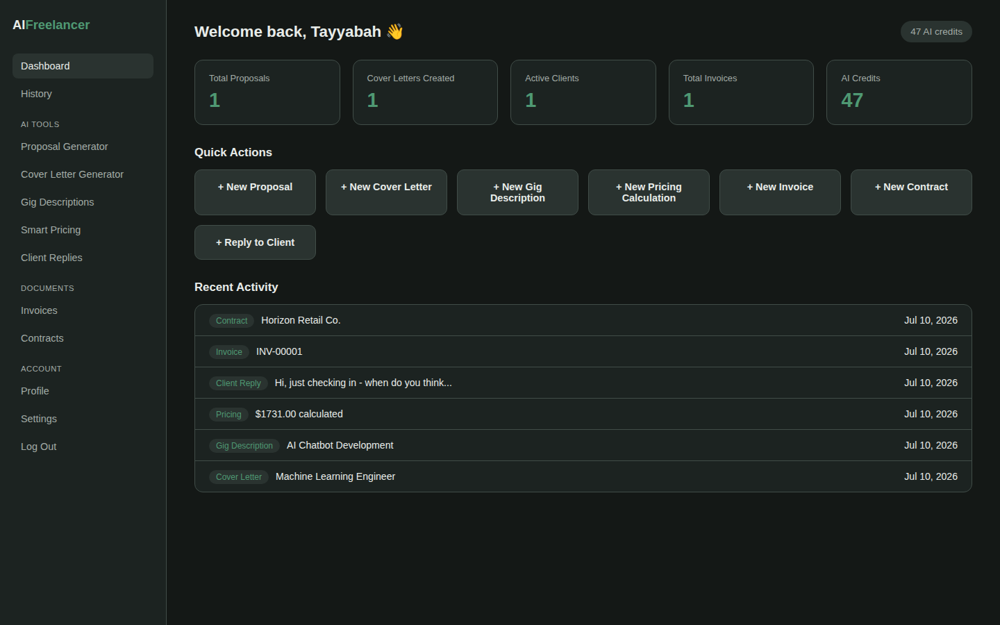

# AI Freelancer Assistant

An AI-powered web application that automates the administrative and writing workload of freelancers — proposals, cover letters, gig descriptions, pricing, client replies, invoices, and contracts — all in one authenticated app.

Built with Flask and the Groq AI API (Llama 3.3 70B), with a deliberate architectural choice: **anything involving money is calculated deterministically, not by AI.** Pricing and invoicing never depend on an external API being reachable — AI is only used for the writing-heavy parts, where it genuinely saves time.



---

## Table of Contents

- [Overview](#overview)
- [Features](#features)
- [Tech Stack](#tech-stack)
- [Architecture](#architecture)
- [Getting Started](#getting-started)
- [Environment Variables](#environment-variables)
- [Project Structure](#project-structure)
- [Security](#security)
- [Deployment](#deployment)
- [API Documentation](#api-documentation)
- [Screenshots](#screenshots)
- [Author](#author)

---

## Overview

Freelancers lose a significant share of their working hours to tasks that aren't billable: writing proposals, estimating fair prices, replying to client messages, and producing invoices and contracts. This app consolidates all of that into a single tool — generate a professional draft in seconds, edit it, export it as a PDF, and move on.

Every document type has a full lifecycle: **create → edit → regenerate → fine-tune → export → revisit through history.**

## Features

### AI-Powered Generators
- **Proposal Generator** — client proposals from project details, tone-adjustable
- **Cover Letter Generator** — job application letters tailored to role and experience
- **Gig Description Generator** — one AI call returns a description, SEO keywords, and FAQs, parsed into separate editable fields
- **Client Reply Generator** — tone-controlled replies to client messages
- **Contract Generator** — full freelance service agreements from scope, timeline, and payment terms

### Calculation-Based Tools (no AI dependency)
- **Smart Pricing Calculator** — deterministic price calculation (rate × hours × complexity/urgency multipliers + tax), paired with AI-generated market analysis and delivery-time suggestions on top
- **Invoice Generator** — auto-numbered invoices with line-item PDF export; the total is pure math, so it's never blocked by an AI outage

### Document Management
- PDF export for proposals, cover letters, invoices, and contracts (ReportLab)
- Edit and regenerate any AI-generated content after the fact
- Unified, filterable history across all 7 document types

### Account & Platform
- Registration, login, and session management (Flask-Login)
- Real token-based password reset (no email provider required to test it — the reset link is shown directly)
- Profile editing with avatar upload
- Theme switching (dark/light), personal Groq API key override, language preference
- Dashboard with live stats and recent activity

## Tech Stack

| Layer | Technology |
|---|---|
| Backend | Python 3, Flask 3 (application factory + blueprints) |
| Database / ORM | SQLite, Flask-SQLAlchemy |
| Auth & Forms | Flask-Login, Flask-WTF (CSRF-protected), Werkzeug (password hashing) |
| AI Provider | Groq API — Llama 3.3 70B, OpenAI-compatible chat completion endpoint |
| PDF Generation | ReportLab |
| Rate Limiting | Flask-Limiter |
| Frontend | Server-rendered Jinja2 templates, hand-written CSS (CSS-variable-driven dark/light theme), vanilla JS |
| Deployment | Gunicorn WSGI server, Render/Railway-ready (`Procfile` included) |

## Architecture

```
Browser (User)
      |
      v
Flask App  (auth, dashboard, 8 feature blueprints, CSRF, rate limiting, session auth)
      |
      +--------------------------+
      |                          |
      v                          v
ai_service.py              pricing_engine.py
Groq API (Llama 3.3 70B)   Deterministic pricing math
chat completion             (no external dependency)
      |                          |
      v                          v
SQLAlchemy ORM              pdf_service.py
SQLite database              ReportLab PDF export
      |                          |
      +--------------------------+
                 |
                 v
    Rendered HTML page or downloadable PDF
```

Each feature module (Proposals, Cover Letters, Gig Descriptions, Pricing, Client Replies, Invoices, Contracts) is its own Flask blueprint with its own routes, forms, and templates, sharing the same AI service, PDF service, and database layer.

## Getting Started

### Prerequisites
- Python 3.10+
- A free [Groq API key](https://console.groq.com/keys) (needed for the AI generators; pricing and invoicing work without it)

### Installation

```bash
# 1. Clone the repository
git clone https://github.com/Tayyabah-Rehman/AI-Freelancer-Assistant.git
cd AI-Freelancer-Assistant

# 2. Create and activate a virtual environment
python -m venv venv
venv\Scripts\activate        # Windows
# source venv/bin/activate   # macOS/Linux

# 3. Install dependencies
pip install -r requirements.txt

# 4. Set up environment variables
copy .env.example .env       # Windows
# cp .env.example .env       # macOS/Linux
# then open .env and fill in SECRET_KEY and GROQ_API_KEY

# 5. Run the app
python app.py
```

Visit **http://127.0.0.1:5000** — you'll land on the login page. Click "Sign up" to create an account.

The SQLite database is created automatically on first run at `instance/app.db` — no manual setup needed.

## Environment Variables

| Variable | Required | Description |
|---|---|---|
| `SECRET_KEY` | Yes | Random string used to sign sessions and CSRF tokens. Generate one with `python -c "import secrets; print(secrets.token_hex(32))"` |
| `GROQ_API_KEY` | For AI features | Your Groq API key |
| `GROQ_MODEL` | No | Defaults to `llama-3.3-70b-versatile` |
| `FLASK_ENV` | No | Set to `production` when deployed — enables secure cookies, HSTS, and disables debug mode |
| `DATABASE_URL` | No | Defaults to a local SQLite file; override to point at Postgres/MySQL in production |

## Project Structure

```
ai_freelancer_assistant/
├── app.py                    # Application factory, blueprint registration, security config
├── config.py                 # Environment-driven configuration
├── extensions.py             # db, login_manager, csrf, limiter singletons
├── models.py                 # All database models (9 tables)
├── ai_service.py             # Shared Groq API integration
├── pdf_service.py            # Shared ReportLab PDF generation
├── pricing_engine.py         # Deterministic pricing calculation logic
├── auth/                     # Registration, login, password reset
├── dashboard/                # Widgets, recent activity, quick actions
├── proposals/  cover_letters/  gigs/  pricing/
├── client_replies/  invoices/  contracts/
├── user_profile/             # Profile editing, avatar upload
├── settings/                 # Theme, language, personal API key
├── history/                  # Unified cross-module document history
├── templates/                # Jinja2 templates, mirrored by module
├── static/                   # CSS, JS, uploaded avatars
└── requirements.txt
```

Each feature folder follows the same pattern: `forms.py` (WTForms), `routes.py` (Flask blueprint), and a matching folder under `templates/`.

## Security

- **Rate limiting** on login, registration, password reset, and every AI generation route — protects against brute-force attempts and AI-credit abuse
- **CSRF protection** on every state-changing request (Flask-WTF)
- **Password hashing** via Werkzeug, never stored in plaintext
- **Real password reset** with expiring, signed tokens (`itsdangerous`)
- **Secure, HttpOnly, SameSite cookies**, automatically hardened in production
- **Security headers**: `X-Content-Type-Options`, `X-Frame-Options`, `Referrer-Policy`, HSTS in production
- **Proxy-aware** (`ProxyFix`) for correct behavior behind Render/Railway/nginx
- **File upload validation**: type and size restrictions on avatar uploads
- **User enumeration protection**: password reset gives the same response whether or not an email is registered
- **Prompt injection defenses** on every AI-generation route: system prompts include an instruction-hierarchy notice, user-submitted text is wrapped in explicit delimiters so the model can distinguish data from instructions, and common injection phrasing is detected and logged for monitoring
- Environment-driven debug mode — Flask's debugger is automatically disabled in production

Known, intentional gaps (flagged rather than hidden): no email verification on signup, no 2FA, no Content-Security-Policy header yet (would require refactoring inline styles first).

## Deployment

Ready to deploy to **Render** or **Railway**:

1. Push this repo to GitHub
2. Create a new Web Service, connect your repo
3. Build command: `pip install -r requirements.txt`
4. Start command: `gunicorn app:app` (already in the included `Procfile`)
5. Set environment variables in the platform dashboard: `SECRET_KEY`, `GROQ_API_KEY`, `FLASK_ENV=production`

**Note:** free tiers on most platforms use an ephemeral filesystem, meaning the SQLite database resets on redeploy. Fine for a demo; for persistent data, use a managed Postgres add-on instead (swap one line in `config.py` — no model changes needed).

Vercel and Netlify are not suitable for this project — both are built around static sites and serverless functions, not a persistent Flask + SQLite app.

## API Documentation

Full route-by-route documentation, including the Groq API request shape used for every AI call, is in [`API_DOCUMENTATION.md`](./API_DOCUMENTATION.md).

## Screenshots


The dashboard: live stats (proposals, cover letters, active clients, invoices, AI credits), quick actions into every generator, and a recent activity feed.

See the [`screenshots/`](./screenshots) folder for the rest — all 7 generators, the pricing breakdown, invoice PDF, unified history, profile, and settings.

## Author

**Tayyabah Rehman**
AI/ML Engineer & MPhil Artificial Intelligence Researcher
[GitHub](https://github.com/Tayyabah-Rehman)
